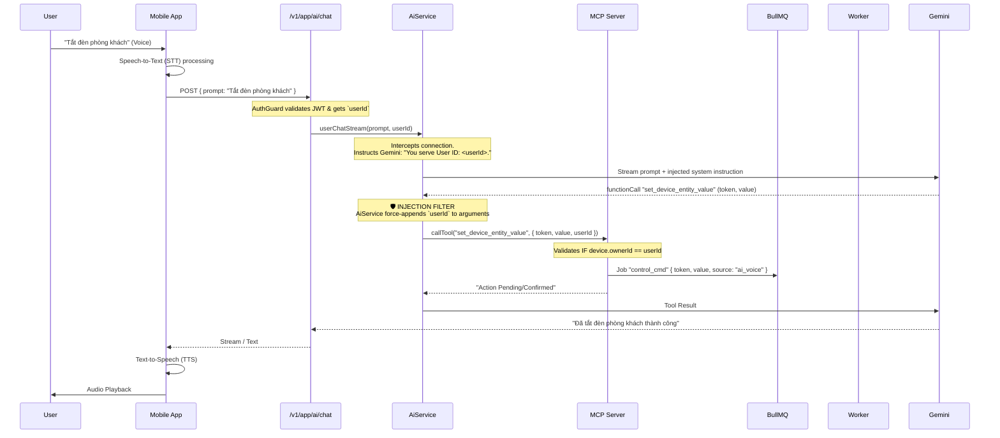

# 1. Voice to AI Control Flow

This document details the exact lifecycle of a voice command originating from the end-user's mobile app and ending up as a physical action in their smart home, driven by the Sensa-Smart AI backend.

## 🔄 End-to-End Flow Diagram

## 🔐 Security & Context Mapping

1. **Voice Text Payload**: The payload from the App is pure text. The backend treats it as a normal prompt.
2. **The "Who am I?" Problem**: Gemini natively doesn't know who is talking. If not scoped, it might search globally.
3. **The Interceptor Solution**:
   - `AiService` wraps the user request.
   - It forcefully injects `userId: string` into every tool schema that the AI generates before evaluating it against the Database via MCP.
